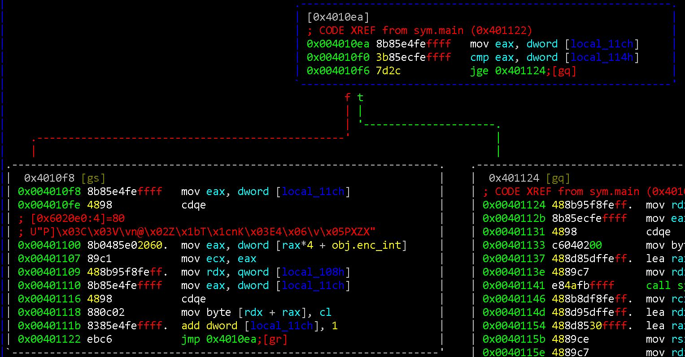
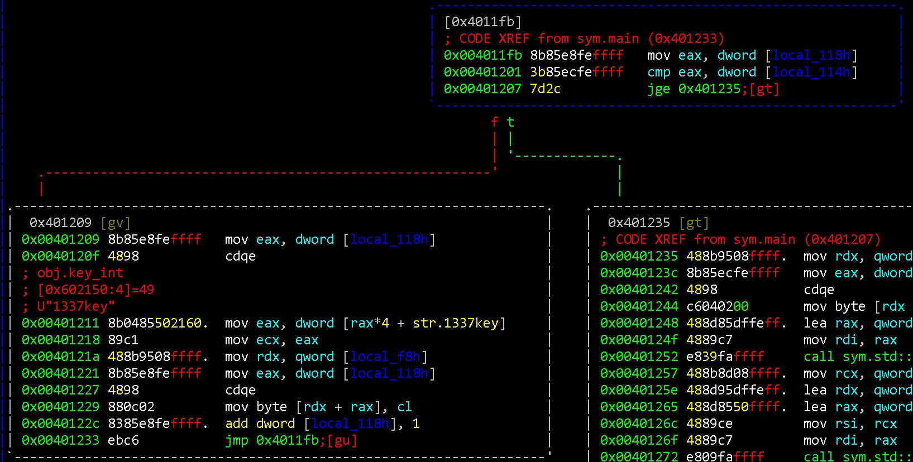
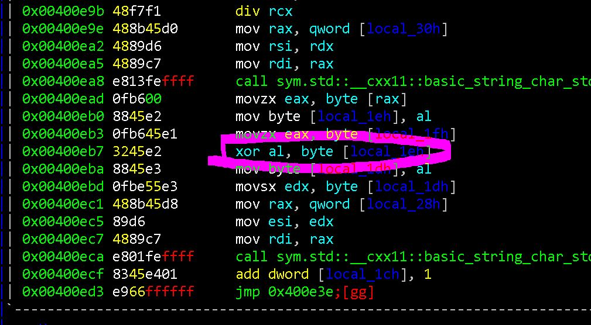

# [ codefest ctf 2019 re ] linux re 1

Challenge Prompt: Reverse the given executable and find the flag.

Taking a cursory look in a hex view of the file, we see UPX related strings.

So we unpack it with `./upx -d run`

Now doing some static analysis of main(), we see a debugger check at 0x00400ff9 where after a call to ptrace(), there is a comparison of some local variable to the value 6.

<p align="center">  </p>

We can bypass this simply by setting a breakpoint at this check and changing the local variable value, or by patching the instruction.

A simple gdb script to do this was:

```
#!/usr/bin/python3

# Usage: gdb -q -x prog.py

import gdb
import struct
       
def main():
    gdb.execute('file ./run')
    # break right at the debugger check
    gdb.execute("b * 0x00400ff9")

    print(gdb.execute('r BBBBBBBBBBBBBBBBBBBBBBBBBBBBBBBBBBBBB', to_string=True))
        
    rbp = gdb.execute("x/wx $rbp-0x120", to_string=True).split(":")[0]
    print(rbp)
	# bypass debugger check by loading 0x6 for comparison
    gdb.execute("set *" + rbp + "=0x6")

if __name__ == "__main__":
    main()

```

Then, we break at 0x004010f0 which is the next comparison before an interesting sequence of bytes
Continuing on, we find that the comparison is used as a loop number check.
26 loops are run which could be related to the number of bytes

<p align="center">  </p>

Then, we break at 0x00401201 which is another comparison for a number of loops, this time the value is 7.
A sequence of bytes is stored onto the stack which is "\x31\x33\x33\x37\x6b\x65\x79\x00" = 1337key

<p align="center">  </p>

We run the program with an input that contains all of the same bytes.

And we notice a pattern of 7 for transforming our bytes before repeating. The sequence of bytes that make up "1337key" is 7 characters as well.

`BBBBBBBBBBBBBB => sqqu)';sqqu)';`

After quite some time walking through the arguments to function calls after address 0x401235, we come across a function at 0x4012c7.

```
rahasya (
	rdi = 0x7ff...eddb0 => 0x00
	rsi = 0x7ff...eddd0 => 0x7ff...edde0 => "1337key"
	rdx = 0x7ff...eddf0 => 0x614ed0 => "BBBBBBBBBBBBBBBBB"
	rcx = 0x7ff...eddd0 => 0x7ff...edde0 => "1337key"
)
```

After this function, another heap chunk has been added and features the transformed bytes `BBBBBBBBBBBBBB => sqqu)';sqqu)';`

We do some reversing inside of this function and see an xor instruction operating on some bytes. Stepping through the instructions and as seen in our repetitive input of B's, we see that each byte of "1337key" is xored with "BBBBBBBB" resulting in "sqqu)';"

<p align="center">  </p>
	
At 0x4012f5, rdi and rsi are loaded before performing a string comparison at 0x401304 where:
rsi is also the same as the enc_int(s)
rsi = 0x614e70 => "\x50\x5d\x03\x43\x03\x56\x0b\x6e\x40\x02\x5a\x1b\x54\x1c\x6e\x4b\x03\x45\x34\x06\x0b\x05\x50\x58\x5a\x58"
rdi = our input transformed

Knowing this, we try and xor the sequence of bytes pointed to by rsi with "1337key" to get the flag.

CodefestCTF{an0th3r_s1mp1e_x0r_cr4ckm3}

<!-- enc_int at 0x6020e0 -->
<!-- key_int at 0x602150 is ascii "1337key" -->