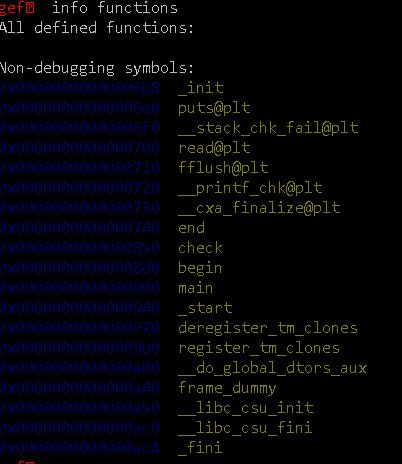
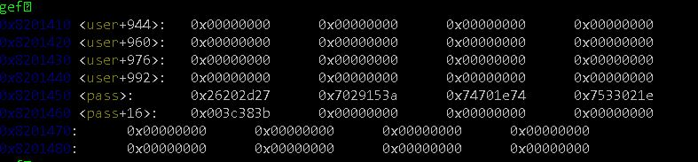
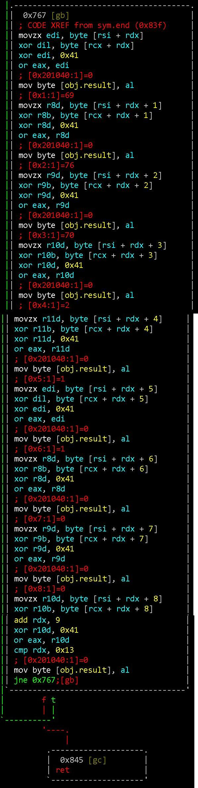

# [ hackcon ctf 2019 re ] babyrev

Challenge Prompt: What comes before main , I wonder .... Note: flag format : flag{XXXXXXX}

Given the hint, and upon viewing of the available functions, noticed symbols for

+ "begin"
+ "end"

<p align="center">  </p>

Running strings on the binary, we get a little hint:

```
'- &:\025)pt\036pt\036\002\063uWrong , PasswordFlag after 16 by\001\033\003;T
```

We find the bytes for obj.pass:

<p align="center">  </p>

Stitching together screenshots, taking a look at the function "end" statically, we see operations being performed on obj.pass whose bytes are located at 0x8201450

<p align="center">  </p>

The assembly instructions show that 8 sequential bytes at a time are each xor'ed with 0x41 which is the ascii character "A".

We write some short code to xor 0x41 with each byte of the string "\x27\x2d\x20\x26\x3a\x15\x29\x70\x74\x1e\x70\x74\x1e\x02\x33\x75\x3b\x38\x3c".

```
λ go run xor_decode.go
Encrypted: flag{Th15_15_Cr4zy}
Decrypted: '- &:§)pt▲pt▲☻3u;8<
```
